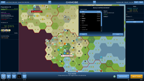
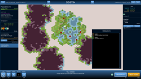
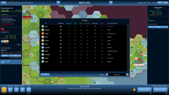
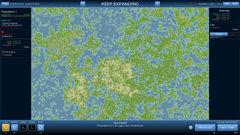

# Hexpansio

**Download:** [hexpansio.jar](https://github.com/ashurrafiev/Hexpansio/releases/download/B.1.1/hexpansio.jar) (1.04 MB)

## About this game

_4X game on a virtually infinite map._

Build new cities, expand borders, assign workers to harvest resources.
Desert, forest, mountain, ocean biomes bring their challenges and unique benefits.
Watch closely your population happiness to avoid the collapse of your Empire.

### The Void

The Void is your enemy.

You can't defeat it with weapons. It grows and spreads across the land devouring everything and everyone on its path.

The only way to stop it is to keep your people happy, this way the void storms are less likely to cross your borders.
But if you fail, then run! Keep moving to new settlements and don't let the void surround you.

_Let not the Void consume your land._  
_Let not the Void consume your spirit._

## Screenshots

## How to play

See the [manual](https://ashurrafiev.github.io/Hexpansio/manual) (WIP)
